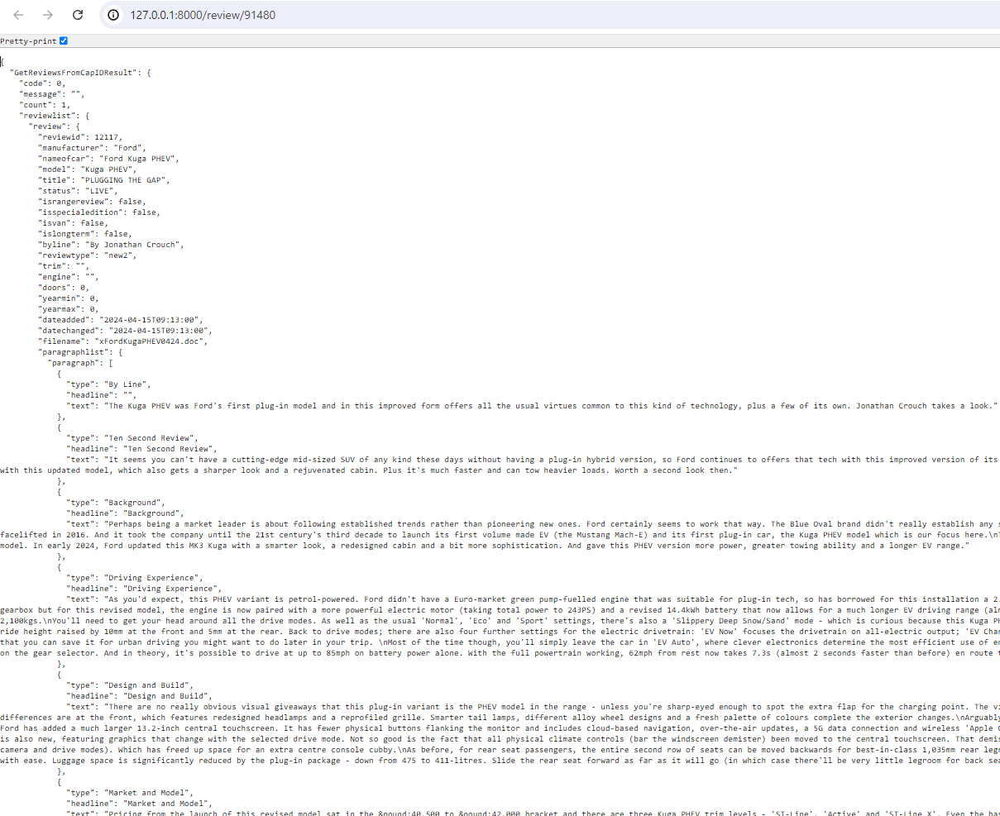

<p align="center"><a href="https://laravel.com" target="_blank"></a></p>

<h1 align="center">Demo Web Car and Driving</h1>

The aim of this task is to pull car reviews from Car And Driving (https://www.caranddriving.com/) Web Services.

## Requirement

```
Laravel: 11
PHP >= 8.2     
Bootstrap: 5.3
```

## Installation

- Clone this repository. Then, cd to folder of source.
- Install PHP packages

    ```
    composer install
    ```
- Copy file .env.example to config environment in .env
    ```
    cp .env.example .env
    ```
- Generate key in configuration file
    ```
    php artisan key:generate
    ```
- Install Node packages and compile assets (CSS, JS):
  ```
  npm install
  npm run dev (or npm run prod for production)
  ```
  Finally, Run command line below and open browser at [http://127.0.0.1:8000](http://127.0.0.1:8000)
  ```
  php artisan server
  ```
  
## Demo Tasks
1. **Pull data from Car and Driving Web Service with a JSON object response**
    [http://127.0.0.1:8000/review/91480](http://127.0.0.1:8000/review/91480)

    

2. **View the Car Review Page by sending an AJAX request to the endpoint created in Task 1**:
    [http://127.0.0.1:8000/view/91480](http://127.0.0.1:8000/view/91480)

    

## About Laravel

Laravel is a web application framework with expressive, elegant syntax. We believe development must be an enjoyable and creative experience to be truly fulfilling. Laravel takes the pain out of development by easing common tasks used in many web projects, such as:

- [Simple, fast routing engine](https://laravel.com/docs/routing).
- [Powerful dependency injection container](https://laravel.com/docs/container).
- Multiple back-ends for [session](https://laravel.com/docs/session) and [cache](https://laravel.com/docs/cache) storage.
- Expressive, intuitive [database ORM](https://laravel.com/docs/eloquent).
- Database agnostic [schema migrations](https://laravel.com/docs/migrations).
- [Robust background job processing](https://laravel.com/docs/queues).
- [Real-time event broadcasting](https://laravel.com/docs/broadcasting).

Laravel is accessible, powerful, and provides tools required for large, robust applications.